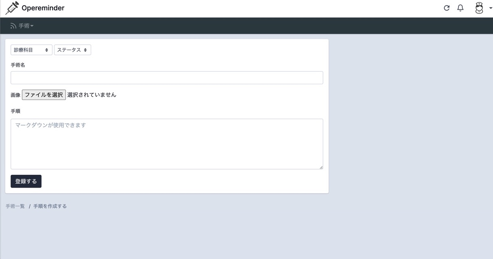

# Opereminder

自身の転職活動用に作成した、ポートフォリオアプリです。 
Ruby on Rails(ver. 5.2.4)を用いて、手術室ナースのためのリマインダーサービスを作成致しました。 
前職の手術室ナースとしての経験を生かし、手術室ナースにとって使いやすく、あったら便利なサービスとなるよう工夫致しました。 

 

## 制作の背景

前職の手術室ナースとして病院に務めていた際に、私の職場では全ての診療科目の手術手順が紙で管理されていました。 
医師からの急な手順の変更時には口頭での周知&手書きで手順に追記を行っていました。 
そのことによる伝達漏れが発生し、不便に感じていました。 
そこで、手術手順の変更時にリマインドしてくれるようなサービスがあったらいいなと思い、作成することと致しました。

 

## 本番環境 URL

https://opereminder.com/ 

閲覧の際は、通常のユーザー登録・ログイン機能によるご確認のほか、ログインページの「ゲストログイン」ボタンから、ゲストユーザーアカウントによるご確認もご利用いただけます。 
管理者としてログインする際は以下のメールアドレス・パスワードでご利用いただけます。 
管理者 メールアドレス: n.k.0213.0529@gmail.com パスワード: 000000  
本ポートフォリオは、タブレット・スマートフォンからもご覧いただけます。

 

## 使用技術

- **バックエンド**

  - Ruby 2.6.5
  - Rails 5.2.4
  - PostgreSQL 12.2

- **フロントエンド**

  - html
  - JavaScript
  - jQuery

- **インフラストラクチャー**

  - ローカル開発環境

    - Docker 19.03.12
    - docker-compose 1.26.2
    - Nginx, puma

  - AWS
    - VPC
    - EC2
    - ELB
    - Route53
    - ACM
    - S3
    - Docker
    - docker-compose
    - Nginx, puma

## アプリケーション構成図

## 機能一覧

- ログイン機能

- ユーザー登録機能
  - メールアドレス、名前、パスワードは必須

- ユーザー編集機能

- 管理者権限
  - 手順の削除は管理者のみ行える
  - ユーザー作成・編集・削除操作ができる

- 手術手順一覧表示機能
  - コメント数を表示

- 手術手順作成機能
  - 手術名、診療科目、手順は必須
  - 手順をMarkdown形式で投稿できる

- 手術手順編集機能
  - 手順一覧、作成、編集はプレミアム会員登録(定期課金)しているユーザーのみ実行可能

- 手術手順削除機能
  - 手順の削除は管理者のみ実行可能

- カード決済機能
  - 定期課金(毎月27日に1000円の課金)することで、プレミアム会員登録できる。手順投稿・編集機能を使用できるようになる

- 手順のストック機能
  - 手順のストックについては、1つの手順に対して一人一回しかできない

- コメント機能とストック機能については、ページ遷移なしで実行できる

- メール機能
  - コメント・手順作成・編集完了時、ユーザー全員にメールで通知される

- 検索機能
  - 診療科目・手術名のキーワード(あいまい)検索、ステータスそれぞれの検索、または絞り込み検索が可能

- コメント機能
  - 手術手順に対し、コメントをすることが可能

- バッチ処理
  - 変更した手順を確認していないユーザーに対し、定期的(毎週月曜日の8時)に通知を行う

- 通知機能
  - 自分が投稿した手順に対してコメント、ストックされた際に、画面上に通知される

- その他

  - ページネーション機能あり
  - オリジナルエラーページ(404,500)あり

### ユーザー登録画面

### ログイン画面

### 手順一覧画面

### 手順投稿画面

## 使用Gem
* CarrierWave
* mini_magick
* devise
* rails_admin
* cancancan
* Kaminari
* faker
* redcarpet
* coderay
* payjp
* fog-aws